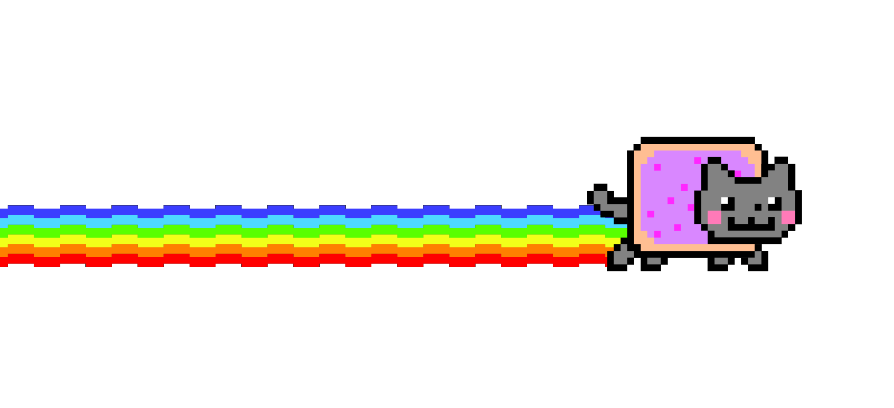

```php
❯ php artisan tinker

# Psy Shell v0.12.9 (PHP 8.5.4 — cli) by Justin Hileman

>>> $tony = new Developer(
    role: 'full-stack web developer',
    company: 'idealista',
    location: 'spain',
    languages: ['php', 'typescript'],
    stack: ['laravel', 'vue', 'symfony', 'react'],
    editor: 'vscode',
    site: 'https://antoniorm.dev',
);
=> Developer {#1312}
```

<p>
  
</p>
